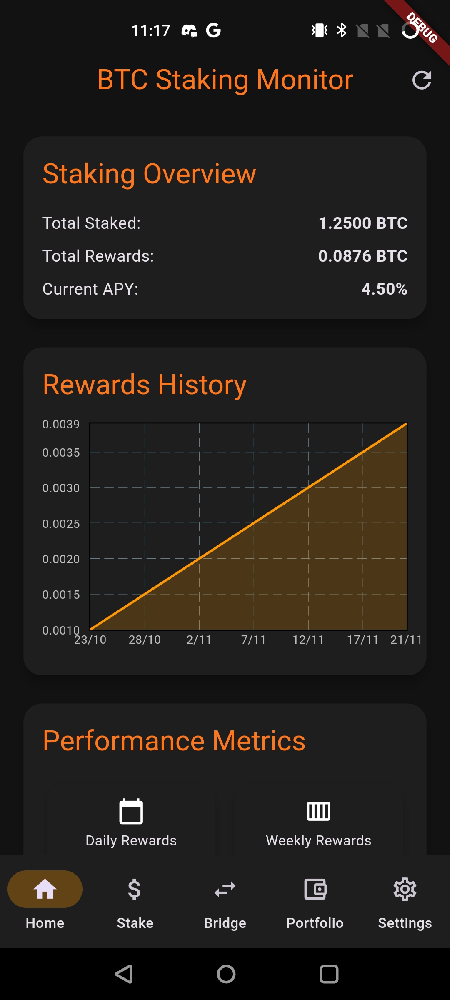
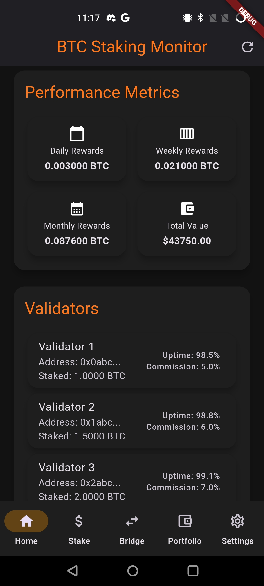
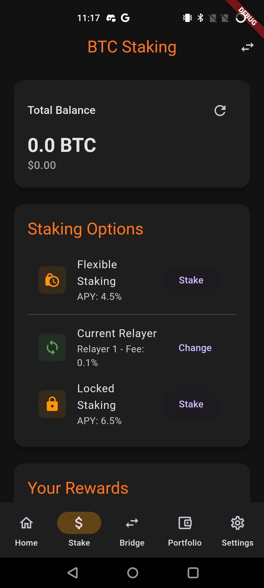
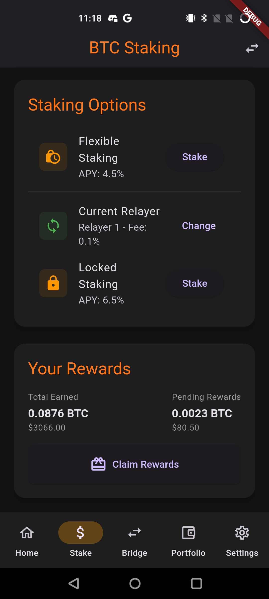
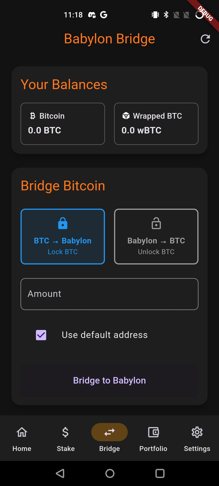
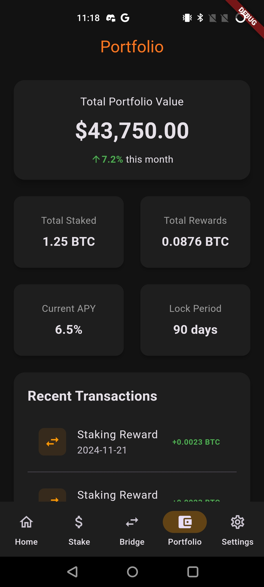
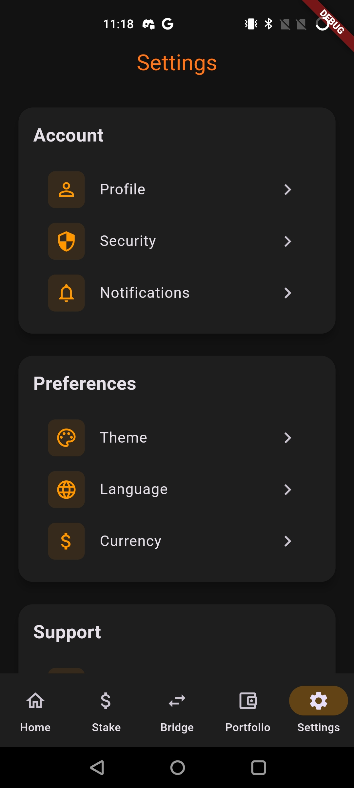

# BTC Bridge DApp FRONTEND mobile design

**BTC-Bridge-DApp** is a decentralized application (DApp) built using **Flutter** for the frontend. It facilitates secure Bitcoin (BTC) transfers across compatible blockchains via a bridge mechanism.

##








## 🛠️ Features

- **Secure Wallet Connection**: Connect your wallet securely to use the bridge.
- **BTC Cross-Chain Transfers**: Transfer Bitcoin to other compatible blockchains.
- **User-Friendly Interface**: Built with Flutter for a smooth and responsive user experience.
- **Multi-Wallet Support**: Compatible with wallets like MetaMask, WalletConnect, and more.
- **Real-Time Statistics**: View exchange rates, transaction fees, and transaction history.

---

## 🧰 Technologies Used

- **Flutter**: The main framework for the frontend.
- **Dart**: Primary language for app development.
- **Web3**: APIs to interact with smart contracts.
- **Bitcoin APIs**: Integration for reading and processing Bitcoin transactions.
- **Smart Contracts**: Bridge implementations for EVM-compatible blockchains.

---

## 🚀 Installation & Setup

### Prerequisites

1. **Flutter SDK** installed. [Installation Guide](https://flutter.dev/docs/get-started/install).
2. **Dart** configured.
3. A crypto wallet to test the application.

### Steps

1. Clone this repository:
```bash
git clone https://github.com/Ty-HA/btc-bridge-dapp.git
```

Navigate to the project directory:
```bash
cd btc-bridge-dapp
```

Install the dependencies:
```bash
flutter pub get
```

Run the application on a simulator or connected device:
```bash
flutter run
```

## 📦 Project structure
```
btc-bridge-dapp/
├── lib/
│   ├── main.dart         # Entry point of the application
│   ├── screens/          # App screens
│   ├── widgets/          # Reusable components
│   ├── services/         # API and Web3 interactions
│   ├── models/           # Data models
│   └── utils/            # Utility functions and helpers
├── pubspec.yaml          # Dependency configurations
├── README.md             # Project documentation
└── ...
```
## 💡 Roadmap
- Add compatibility with additional blockchains (e.g., Solana, Polkadot).
- Implement staking functionality for users.
- Enhance error handling and transaction validation.
- Optimize the UI for better accessibility.

## 📝 Author
Developed with ❤️ by Ty HA.
